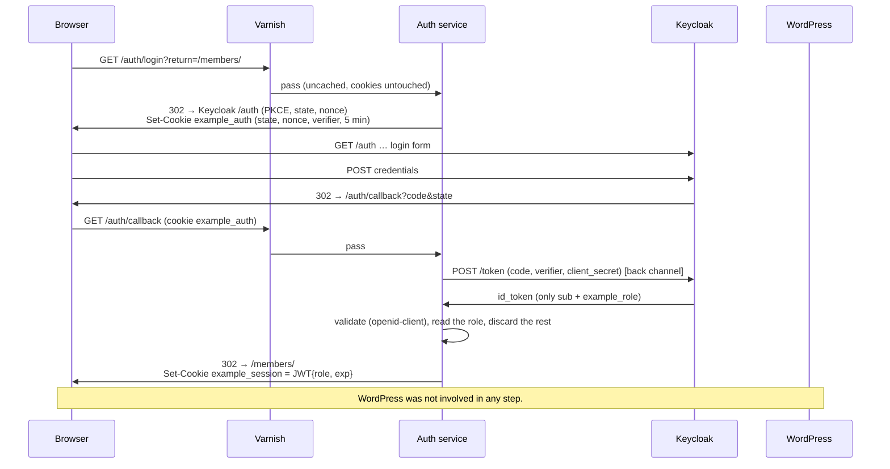
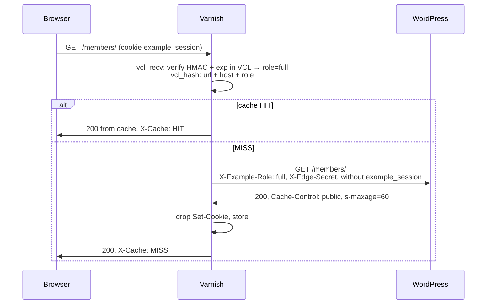
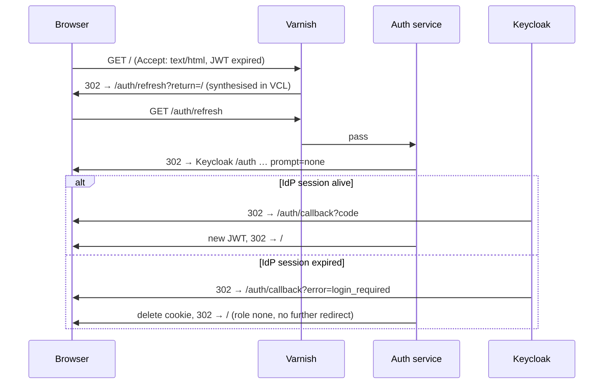

# Prototype: OIDC login with role-based edge caching for WordPress

A proof of concept for this pattern: users log in at a separate OIDC identity provider, WordPress stores **no** user data and knows **no** identity. WordPress only learns an access level (`none`, `limited`, `full`) and renders different content accordingly. The site stays fully cacheable: Varnish caches per level, never per cookie or person.

```
Browser ──► www.localhost:8000  Varnish ──────────────► wordpress:80 (Apache/PHP) ──► db (MariaDB)
   │           │  every request: verify session JWT in VCL → X-Example-Role → cache per (role, URL)
   │           └── /auth/* ────► auth:3000 (Express + openid-client, the OIDC relying party)
   └──────────► auth.localhost:8080  Keycloak, realm "example"
                  ▲ auth service back channel (token, JWKS) uses the same URL via extra_hosts
```

## Core principles

1. **WordPress is not an OIDC client.** A small auth service is the relying party (built on [openid-client](https://github.com/panva/openid-client)) and serves `/auth/*`. The `id_token` never leaves it.
2. **The IdP token never goes into the cookie.** The auth service mints a minimal JWT with `role`, `iat`, `exp`. No `sub`, no email. CDN and Varnish logs therefore contain no PII either.
3. **Varnish is the only thing in front of WordPress.** It verifies the JWT in VCL (HMAC-SHA256), sets `X-Example-Role`, strips the edge cookies towards the origin and drops `Set-Cookie` from cacheable responses. Whatever the client claims about its role is discarded.
4. **Origin protection.** WordPress only accepts requests carrying a valid `X-Edge-Secret` (mu-plugin, cannot be deactivated). Direct access yields 403.
5. **Role in the hash, not in `Vary`.** `vcl_hash` adds the role; static assets share one entry across roles.
6. **Short role lifetime, silent refresh.** The role JWT lives 15 minutes. After that Varnish sends one `prompt=none` round trip via the auth service; if the IdP session is still alive the user notices nothing. Otherwise they fall back cleanly to `none`.

## Getting started

Prerequisites: Docker with Compose v2, Node ≥ 22 (for the scripts only), Chrome or Firefox.

```bash
cp .env.example .env      # optional, compose carries the same defaults
docker compose up -d --build
docker compose logs -f wp-init keycloak   # wait for "[wp-init] done" and "Keycloak … started"
```

| Service | URL | Credentials |
| --- | --- | --- |
| Site (through Varnish) | http://www.localhost:8000 | |
| Keycloak admin | http://auth.localhost:8080/admin/ | `admin` / `admin` |
| WordPress admin (through Varnish) | http://www.localhost:8000/wp-admin/ | `admin` / `admin` |
| WordPress directly (only to demo the 403) | http://localhost:8081 | |

Chrome, Firefox and Linux with systemd-resolved resolve `*.localhost` to 127.0.0.1 on their own. If not: add `127.0.0.1 www.localhost auth.localhost` to `/etc/hosts`.

### Demo users (password is `password` for all)

| User | Attribute `example_role` in the IdP | Result on the site |
| --- | --- | --- |
| `anna` | `full` | sees everything |
| `ben` | `limited` | sees public and limited content |
| `carla` | not set | is logged in but has level `none` |

### Demo in the browser

1. Open http://www.localhost:8000. The badge shows `none`, the login hint is visible.
2. "Log in now" → Keycloak login page on `auth.localhost` → log in as `anna` → back on the site with level `full`.
3. DevTools → Application → Cookies: `www.localhost` only holds `example_session`. Decode the payload: only `role`, `iat`, `exp`.
4. Network tab: response header `X-Cache: HIT` on reload, `X-Cache-Key: full|www.localhost:8000|/`.
5. "Log out" → Keycloak confirmation → back with `none`.
6. Log in as `ben`: different cache entry, different content. As `carla`: logged in, still `none`.

### Automated checks

```bash
scripts/demo.sh                 # curl checks (cache, header hygiene, 403, PKCE) + login/logout flows for all users
scripts/demo.sh --with-refresh  # additionally silent refresh and the refresh failure case (auth service briefly runs with a 5s JWT)
scripts/varnishtest.sh          # VCL tests (varnish/tests/edge.vtc) with mocked WordPress and auth backends
node scripts/login-flow.mjs login anna   # a single flow, shows every redirect hop
cd auth && npm test                      # unit tests for the session JWT
```

Useful while watching: `docker compose exec varnish varnishlog -q 'ReqURL ~ "^/"' -i ReqURL,ReqHeader,RespHeader` and `docker compose exec varnish varnishstat -1 -f MAIN.cache_hit -f MAIN.cache_miss`. Clear the cache with `docker compose exec varnish varnishadm ban 'req.url ~ .'`.

## Flows

### Login



### Cached request



### Silent refresh after the role JWT expired



## What the VCL does (`varnish/edge.vcl`)

| Step | Behaviour |
| --- | --- |
| Role | `edge_role_from_cookie`: split the JWT, pin `alg`/`typ`, compare `digest.hmac_sha256` with the base64url-decoded signature (via `vmod_blob`), check `exp`, whitelist the role. Missing, invalid, tampered → `none`. Expired + HTML navigation → `synth(752)` → 302 to `/auth/refresh`. |
| Request hygiene | Discard `X-Example-Role`, `X-Edge-Secret`, `X-Forwarded-*` from the client. `cookie.filter` removes `example_session`/`example_auth`. Then set the edge's own values. Internal working headers are unset in `vcl_backend_fetch`. |
| Routing | `/auth/*` → backend `auth`, always `pass`, cookies untouched. Everything else → backend `wordpress`. |
| Bypass | Anything but GET/HEAD, `/wp-admin`, `/wp-login.php`, `/wp-cron.php`, `/xmlrpc.php`, or a `wordpress_logged_in_*` cookie (WP editors). Other cookies do not prevent caching. |
| Hash | `url` + `Host` + role; under `/wp-content/` and `/wp-includes/` without the role. |
| Store | `vcl_backend_response` drops `Set-Cookie` on cacheable fetches (logged via `std.log`) and turns non-200 into a short hit-for-miss. TTL from `s-maxage`/`max-age`, else `default_ttl` (60 s). The built-in VCL still handles `private`/`no-store`. |
| Debug headers | `X-Cache: HIT\|MISS\|UNCACHEABLE\|BYPASS(reason)\|REFRESH`, `X-Example-Role`, `X-Cache-Key`, plus Varnish's own `Age` and `Via`. |

Secrets enter the VCL through `config.vcl`, rendered from `SESSION_SECRET` and `EDGE_SHARED_SECRET` by `varnish/entrypoint.sh` at container start. The tests define their own `edge_config` with fixed values.

## Auth service (`auth/`)

Express 5 with `openid-client` and `jose`. Four routes: `/auth/login`, `/auth/refresh` (same, with `prompt=none`), `/auth/callback`, `/auth/logout`. State, nonce and PKCE verifier travel in a signed, short-lived `example_auth` cookie, so the service is stateless. Discovery runs lazily and is retried while Keycloak is still starting. The session JWT is HS256 with `typ: example-session+jwt`; the `typ` is what lets the VCL reject the auth-state JWT even though both share the key.

## WordPress side

- `wordpress/mu-plugins/edge-guard.php`: 403 for anything without a valid `X-Edge-Secret` (`hash_equals`). WP-CLI and cron are exempt. Fails closed if the secret is missing.
- `wordpress/plugins/example-role/example-role.php`: `example_role()`, `example_role_at_least()` and shortcodes. No DB access, no options, no user data.

```
[example_role_content min="limited"]…[/example_role_content]        from this level upwards
[example_role_content only="none,limited"]…[/example_role_content]  exactly these levels
[example_role_badge label="…"]   [example_login_link text="…"]   [example_logout_link text="…"]
```

The login link carries the current path as `return`. It is part of the page cached per role, so it is not personal data.

## Pitfalls of the local environment

- **`vmod_digest` has to be compiled into the image.** The official `varnish:7.7` image ships `cookie`, `var`, `blob`, `std` and the `install-vmod` helper; `varnish/Dockerfile` builds `libvmod-digest` against the `varnish-dev` package found in `/pkgs`. Its `base64url_*_hex` helpers are unreliable in 1.0.3, so the signature is transcoded with the built-in `vmod_blob` instead.
- **Keycloak sets `Secure` cookies on `*.localhost`**, because like browsers it treats `*.localhost` as a secure context. Chrome and Firefox accept that over http, `curl` does not. That is why `scripts/login-flow.mjs` plays the browser for the automated flows.
- **One hostname for Keycloak, also inside Docker.** `openid-client` checks during discovery that the issuer matches the URL it was fetched from, so the auth container must reach Keycloak under the browser's URL. `extra_hosts: auth.localhost:host-gateway` maps that name to the Docker host, where Keycloak's port 8080 is published.
- **Keycloak without persistence.** The realm is imported fresh on every start (dev mode). Changes made in the admin UI are lost on restart; permanent changes belong in `keycloak/realm-example.json`.
- **Logout shows a confirmation page**, because the auth service does not send an `id_token_hint`. It deliberately does not store the `id_token`.
- The session cookie lives longer (12 h) than the JWT (15 min). Only then can an expired JWT trigger the silent refresh.
- Varnish logs a harmless `mlock() of VSM failed` warning in Docker; raising the `memlock` ulimit silences it.

## Open points for production

- **Asymmetric signature.** HS256 means the HMAC key sits in the VCL of every Varnish node. With `vmod_crypto` (UPLEX, OpenSSL-based) Varnish could verify ES256/RS256 with the public key only, and the auth service would hold the private key. Same VCL shape, different vmod.
- **HTTPS everywhere**, `Secure` cookies, HSTS. `__Host-` prefix for the session cookie. TLS termination (Hitch or similar) in front of Varnish.
- **Key rotation** for `SESSION_SECRET` (`kid` in the JWT header, two valid keys during rotation; a VCL `if` on the `kid`).
- **Revocation latency.** A role change takes effect only after `exp` (up to 15 min). If that is too long: shorter TTL, or an opaque session id with a lookup at the edge instead of a JWT.
- **Rate limiting** on `/auth/*` (`vmod_vsthrottle` ships with the image), especially `/auth/callback`.
- **Role source in the IdP.** A user attribute in the prototype. For real: a group, a subscription status, or a mapper onto an external system. The claim `example_role` stays the interface.
- **More roles = more cache variants.** Three levels are harmless. Do not put fine-grained claims into the hash.
- **Feeds, REST API, search** need the same treatment as pages (happens automatically through the hash, but check deliberately). Consider `pass` for `?s=` searches.
- **Purging** when content changes: the WordPress side needs a purge/ban hook towards Varnish, e.g. `vmod_xkey` (ships with the image) with a post-id tag on every page.
- **Block editor integration** instead of shortcodes: a "level … and up" container block with the same server-side logic.
- **Personalisation**, if ever wanted, only client-side via JS against the userinfo endpoint. The cached page stays anonymous.
- **Monitoring.** Hit rate per role (log `X-Example-Role`), number of `REFRESH` responses, IdP error rates in the auth service.

## File layout

```
docker-compose.yml           stack: db, wordpress, wp-init, keycloak, auth, varnish
.env.example                 secrets and TTLs (defaults also in compose)
keycloak/realm-example.json  realm, client example-web (PKCE, scope basic only), mapper, demo users
varnish/Dockerfile           varnish:7.7 + libvmod-digest
varnish/entrypoint.sh        renders config.vcl from the environment, then starts varnishd
varnish/default.vcl          backends + includes (Docker wiring)
varnish/edge.vcl             the logic: role from JWT, hygiene, routing, hash, delivery
varnish/config.vcl.template  sub edge_config with the two secrets
varnish/tests/edge.vtc       varnishtest with mocked WordPress and auth backends
auth/src/config.js           env configuration
auth/src/session.js          session JWT, auth-state JWT, cookie helpers, safeReturnPath
auth/src/oidc.js             openid-client: discovery, PKCE, code exchange, id_token validation
auth/src/index.js            routes /auth/*
auth/test/                   node --test
wordpress/mu-plugins/        edge-guard.php (origin protection)
wordpress/plugins/           example-role (reads the header, shortcodes)
wordpress/init.sh, content/  wp-cli setup and demo pages
scripts/demo.sh              curl checks + flows
scripts/varnishtest.sh       runs the VCL tests inside the Varnish image
scripts/login-flow.mjs       browser simulation: login, logout, refresh, refresh-fail
```
