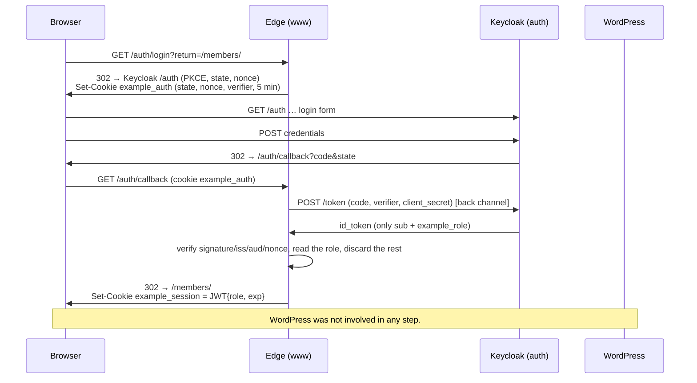
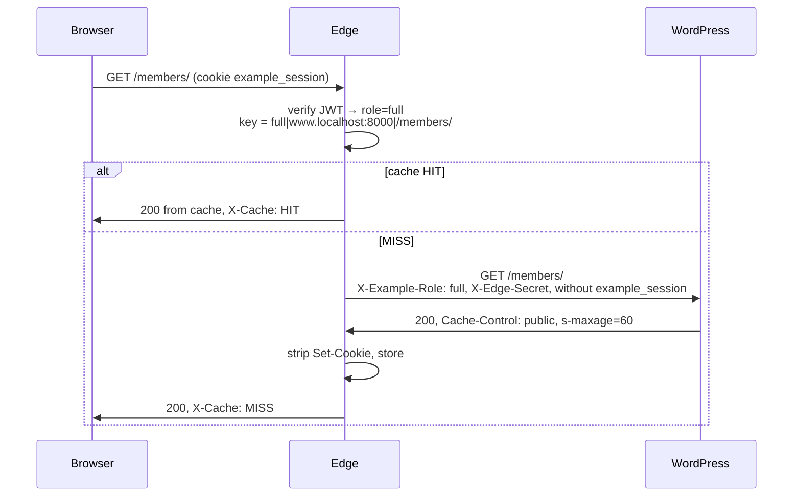
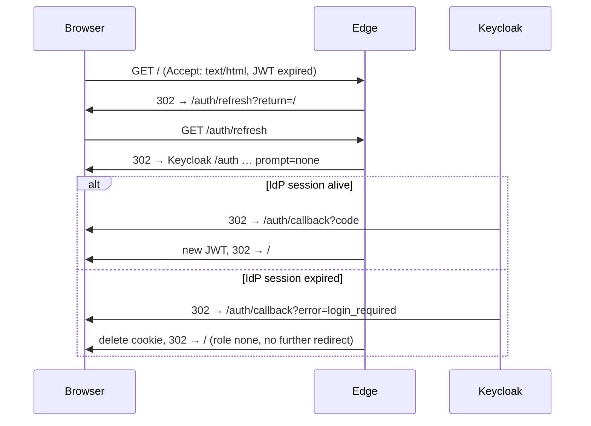

# Prototype: OIDC login with role-based edge caching for WordPress

A proof of concept for this pattern: users log in at a separate OIDC identity provider, WordPress stores **no** user data and knows **no** identity. WordPress only learns an access level (`none`, `limited`, `full`) and renders different content accordingly. The site stays fully cacheable: the cache varies by level, never by cookie or person.

```
Browser ──► www.localhost:8000  (edge: Node/Express)  ──► wordpress:80 (Apache/PHP) ──► db (MariaDB)
   │              │  /auth/*   OIDC relying party, cookie example_session (role + expiry only)
   │              │  else      derive role → set X-Example-Role → cache per (role, URL)
   └──────────► auth.localhost:8080  (Keycloak, realm "example")
                  ▲ edge back channel (token, JWKS) uses the same URL via extra_hosts
```

## Core principles

1. **WordPress is not an OIDC client.** The edge is the relying party (built on [openid-client](https://github.com/panva/openid-client)) and serves `/auth/*`. The `id_token` never leaves the edge.
2. **The IdP token never goes into the cookie.** The edge mints its own minimal JWT with `role`, `iat`, `exp`. No `sub`, no email. CDN logs therefore contain no PII either.
3. **Header hygiene at the edge.** An `X-Example-Role` sent by the client is always overwritten. The session cookie is stripped before the request reaches the origin. `Set-Cookie` is removed from cacheable responses.
4. **Origin protection.** WordPress only accepts requests carrying a valid `X-Edge-Secret` (mu-plugin, cannot be deactivated). Direct access yields 403.
5. **Explicit cache keys.** `role|host|path?query`. No reliance on `Vary`. Static assets do not vary by role.
6. **Short role lifetime, silent refresh.** The role JWT lives 15 minutes. After that, one `prompt=none` round trip to the IdP; if its session is still alive the user notices nothing. Otherwise they fall back cleanly to `none`.

## Getting started

Prerequisites: Docker with Compose v2, Node ≥ 22 (for the scripts only), Chrome or Firefox.

```bash
cp .env.example .env      # optional, compose carries the same defaults
docker compose up -d --build
docker compose logs -f wp-init keycloak   # wait for "[wp-init] done" and "Keycloak … started"
```

| Service | URL | Credentials |
| --- | --- | --- |
| Site (through the edge) | http://www.localhost:8000 | |
| Keycloak admin | http://auth.localhost:8080/admin/ | `admin` / `admin` |
| WordPress admin (through the edge) | http://www.localhost:8000/wp-admin/ | `admin` / `admin` |
| WordPress directly (only to demo the 403) | http://localhost:8081 | |
| Cache debug view (prototype only) | http://www.localhost:8000/_edge/cache | `DELETE` clears it |

Chrome, Firefox and Linux with systemd-resolved resolve `*.localhost` to 127.0.0.1 on their own. If not: add `127.0.0.1 www.localhost auth.localhost` to `/etc/hosts`.

### Demo users (password is `password` for all)

| User | Attribute `example_role` in the IdP | Result on the site |
| --- | --- | --- |
| `anna` | `full` | sees everything |
| `ben` | `limited` | sees public and limited content |
| `carla` | not set | is logged in but has level `none` |

### Demo in the browser

1. Open http://www.localhost:8000. The badge shows `none`, the login hint is visible.
2. "Log in now" → Keycloak login page on `auth.localhost` → log in as `anna` → back on the site with level `full`.
3. DevTools → Application → Cookies: `www.localhost` only holds `example_session`. Decode the payload: only `role`, `iat`, `exp`.
4. Network tab: response header `X-Cache: HIT` on reload, `X-Cache-Key: full|www.localhost:8000|/`.
5. "Log out" → Keycloak confirmation → back with `none`.
6. Log in as `ben`: different cache entry, different content. As `carla`: logged in, still `none`.

### Automated demo

```bash
scripts/demo.sh                 # curl checks (cache, header hygiene, 403, PKCE) + login/logout flows for all users
scripts/demo.sh --with-refresh  # additionally silent refresh and the refresh failure case (edge briefly runs with a 5s JWT)
node scripts/login-flow.mjs login anna   # a single flow, shows every redirect hop
cd edge && npm test                      # unit tests for the session JWT and the cache rules
```

## Flows

### Login



### Cached request



### Silent refresh after the role JWT expired



## What the edge does exactly (`edge/src/proxy.js`)

| Step | Behaviour |
| --- | --- |
| Role | Verify cookie `example_session` (HS256, `exp`). Valid → role. Missing, invalid, tampered → `none`. Expired + HTML navigation → one trip to `/auth/refresh`. |
| Request hygiene | Discard `X-Example-Role`, `X-Edge-Secret`, `X-Forwarded-*` from the client. Remove `example_session`/`example_auth` from the Cookie header. Then set the edge's own values. |
| Bypass | Anything but GET/HEAD, `/wp-admin`, `/wp-login.php`, `/auth/*`, `/_edge/*`, or a `wordpress_logged_in_*` cookie (WP editors). On bypass, `Set-Cookie` is passed through. |
| Cache key | `role\|host\|path?query`; under `/wp-content/` and `/wp-includes/` the role is replaced by `-`. |
| Store | Only status 200 and only if `Cache-Control` contains neither `private`, `no-store` nor `no-cache`. TTL: `s-maxage` > `max-age` > default 60 s. |
| Debug headers | `X-Cache: HIT\|MISS\|BYPASS\|UNCACHEABLE`, `X-Example-Role`, `X-Cache-Key`, `Age`. |
| Logging | Method, path, role, cache status. Never cookies, tokens or query strings. With `DEBUG_CLAIMS=1` additionally the claim **names** of the id_token. |

## WordPress side

- `wordpress/mu-plugins/edge-guard.php`: 403 for anything without a valid `X-Edge-Secret` (`hash_equals`). WP-CLI and cron are exempt. Fails closed if the secret is missing.
- `wordpress/plugins/example-role/example-role.php`: `example_role()`, `example_role_at_least()` and shortcodes. No DB access, no options, no user data.

```
[example_role_content min="limited"]…[/example_role_content]        from this level upwards
[example_role_content only="none,limited"]…[/example_role_content]  exactly these levels
[example_role_badge label="…"]   [example_login_link text="…"]   [example_logout_link text="…"]
```

The login link carries the current path as `return`. It is part of the page cached per role, so it is not personal data.

## Pitfalls of the local environment

- **Keycloak sets `Secure` cookies on `*.localhost`**, because like browsers it treats `*.localhost` as a secure context. Chrome and Firefox accept that over http, `curl` does not. That is why `scripts/login-flow.mjs` plays the browser for the automated flows.
- **Node's fetch drops the `Host` header.** WordPress receives the public host via `X-Forwarded-Host`; `WORDPRESS_CONFIG_EXTRA` in `docker-compose.yml` copies it into `HTTP_HOST`. Without that, WordPress issues canonical redirects to `http://wordpress/…`.
- **One hostname for Keycloak, also inside Docker.** `openid-client` checks during discovery that the issuer matches the URL it was fetched from, so the edge container must reach Keycloak under the browser's URL. `extra_hosts: auth.localhost:host-gateway` on the edge service maps that name to the Docker host, where Keycloak's port 8080 is published. Discovery runs lazily on the first request and is retried if Keycloak is still starting.
- **Keycloak without persistence.** The realm is imported fresh on every start (dev mode). Changes made in the admin UI are lost on restart; permanent changes belong in `keycloak/realm-example.json`.
- **Logout shows a confirmation page**, because the edge does not send an `id_token_hint`. The edge deliberately does not store the `id_token`.
- The session cookie lives longer (12 h) than the JWT (15 min). Only then can an expired JWT trigger the silent refresh.

## Open points for production

- **Edge platform.** The Express proxy is a model. On Cloudflare Workers, `caches.default` with a custom cache key takes over the caching; JWT verification runs identically via WebCrypto. With Varnish it would be VCL plus a JWT vmod. The rules in `cache.js` are the core to port.
- **HTTPS everywhere**, `Secure` cookies, HSTS. `__Host-` prefix for the session cookie.
- **Key rotation** for `SESSION_SECRET` (`kid` in the header, two valid keys during rotation). Alternatively asymmetric (ES256) so that additional edge locations only need the public key.
- **Revocation latency.** A role change takes effect only after `exp` (up to 15 min). If that is too long: shorter TTL, or an opaque session id with a KV lookup at the edge instead of a JWT.
- **Rate limiting** on `/auth/*`, especially `/auth/callback` (the token exchange costs the IdP).
- **Role source in the IdP.** A user attribute in the prototype. For real: a group, a subscription status, or a mapper onto an external system. The claim `example_role` stays the interface.
- **More roles = more cache variants.** Three levels are harmless. Do not put fine-grained claims into the key.
- **Feeds, REST API, search** need the same treatment as pages (happens automatically through the key in the prototype, but check deliberately). `?s=` searches are cacheable per query; consider excluding them.
- **Block editor integration** instead of shortcodes: a "level … and up" container block with the same server-side logic.
- **Personalisation**, if ever wanted, only client-side via JS against the userinfo endpoint. The cached page stays anonymous.
- **Monitoring.** Cache hit rate per role, number of silent refreshes, IdP error rates. The debug endpoint `/_edge/cache` does not belong in production.

## File layout

```
docker-compose.yml           stack: db, wordpress, wp-init, keycloak, edge (Express 5, openid-client, jose)
.env.example                 secrets and TTLs (defaults also in compose)
keycloak/realm-example.json  realm, client example-web (PKCE, scope basic only), mapper, demo users
edge/src/config.js           env configuration
edge/src/session.js          session JWT, auth-state JWT, cookie helpers, safeReturnPath
edge/src/oidc.js             openid-client: discovery, PKCE, code exchange, id_token validation
edge/src/cache.js            cache key, bypass rules, TTL derivation, MemoryCache
edge/src/proxy.js            role derivation, header hygiene, origin fetch, cache
edge/src/index.js            routes /auth/*, /_edge/cache, proxy
edge/test/                   node --test
wordpress/mu-plugins/        edge-guard.php (origin protection)
wordpress/plugins/           example-role (reads the header, shortcodes)
wordpress/init.sh, content/  wp-cli setup and demo pages
scripts/demo.sh              curl checks + flows
scripts/login-flow.mjs       browser simulation: login, logout, refresh, refresh-fail
```
