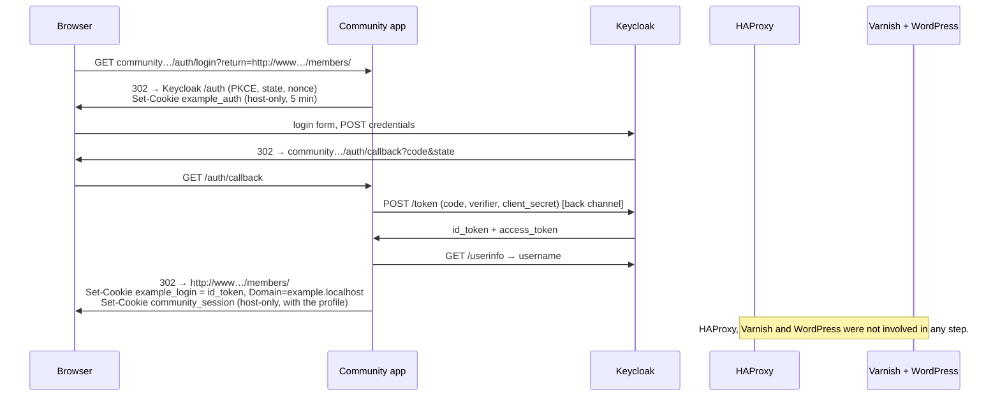
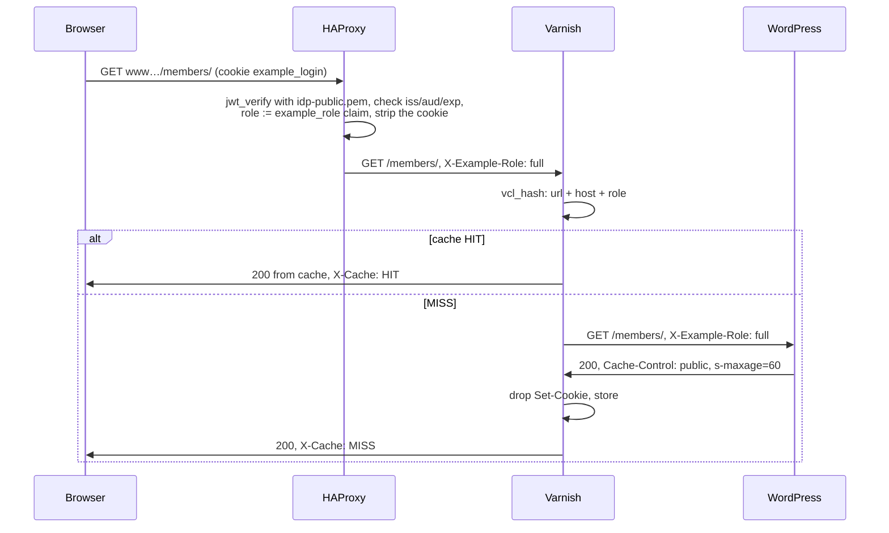
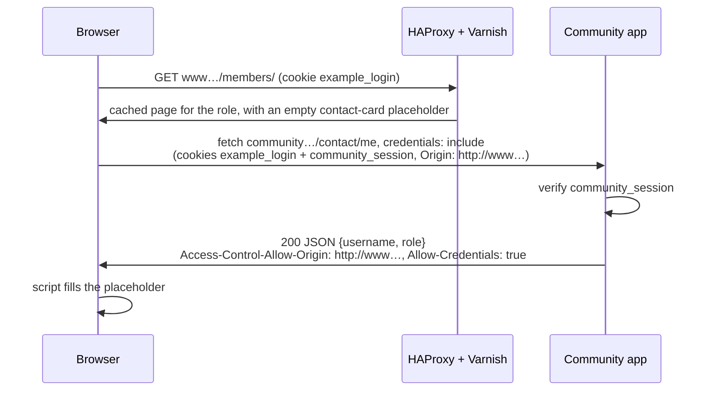
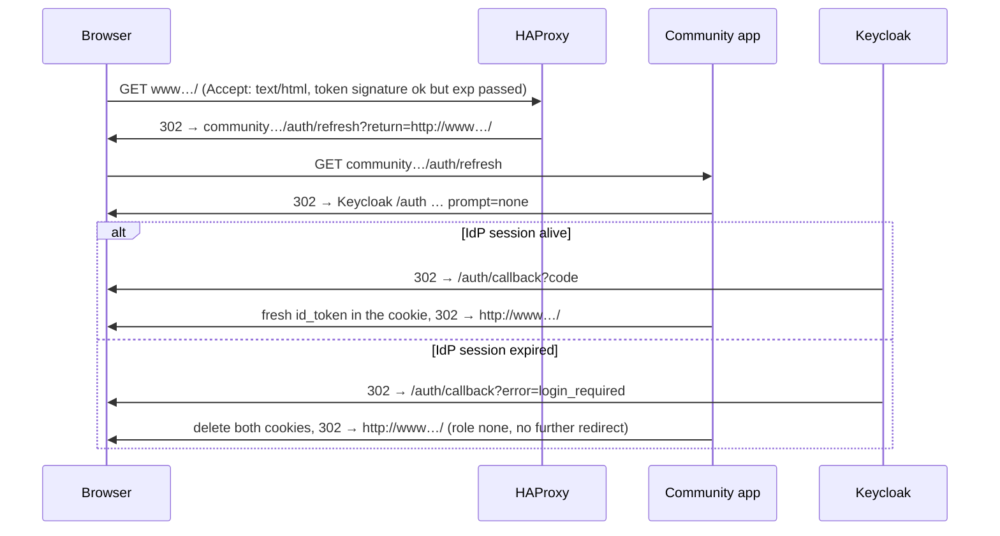

# Prototype: OIDC login with role-based edge caching for WordPress

A proof of concept for this pattern: users log in at an OIDC identity provider through the community app, WordPress stores **no** user data and knows **no** identity. WordPress only learns an access level and renders different content accordingly: `limited` or `full` for logged-in users, `none` for anonymous visitors. The site stays fully cacheable: Varnish caches per level, never per cookie or person.

```
Browser ──► www.example.localhost:8000        HAProxy ──► Varnish ──► WordPress ──► MariaDB
   ├──────► community.example.localhost:8001  community app (Express + openid-client)
   └──────► auth.example.localhost:8080       Keycloak, realm "example" (stands in for the IdP)
```

Three hostnames under one parent domain, three separate services. The community app is the OIDC relying party. After login it sets two cookies: its own host-only session with the profile, and a domain-wide login cookie holding the IdP's lean `id_token`, which is what lets the website see the login. HAProxy, which sits only in front of the website, verifies that cookie on every request with the IdP's public key, sets `X-Example-Role` and removes the cookie. Varnish caches per role. WordPress reads the header.

## Core principles

1. **WordPress is not an OIDC client.** The community app is the relying party and serves `/auth/*`. WordPress never sees a token or a user.
2. **The cookie is the IdP's own `id_token`, and it is lean.** Only the `openid` scope plus the role claim are requested, so the token carries an opaque `sub`, the role and standard timestamps. No email, no name.
3. **Two cookies with two jobs, and a bounded blast radius.** The community app's session with personal data is host-only (`__Host-` over https); nothing but the community app ever sees it. The domain-wide login cookie is received by every host under the parent domain, so it holds nothing but the `id_token`: an opaque `sub`, the level, timestamps. The worst a subdomain can do with it is read the website's gated content as that user for at most 15 minutes; it cannot reach the community API or any personal data.
4. **The edge trusts the IdP, not the community app.** HAProxy verifies the RS256 signature with the IdP's public key on disk and checks `iss`, `aud` and `exp` on every request. The community app is a courier; it cannot invent roles.
5. **Header hygiene in HAProxy.** `X-Example-Role` from the client is discarded, the login cookie is stripped before Varnish, and the role header is set from the verified token only. Anything that fails verification is `none`.
6. **Varnish and WordPress are reachable only through HAProxy.** They live on the Docker network; in production a firewall or private network must guarantee the same, otherwise the header could be forged. The community app is its own public service.
7. **Role in the cache hash, not in `Vary`.** Varnish adds the role in `vcl_hash`; static assets share one entry across roles.
8. **Silent refresh.** When the `id_token` has expired, HAProxy redirects HTML navigations once to the community app's `prompt=none` re-login. If the IdP session is still alive the community app renews the cookie and the user notices nothing; otherwise it deletes the cookie and they fall back cleanly to `none`.
9. **Personal data only client-side.** The cached page never contains it. Pages for logged-in levels carry a small script that calls the community app's `/contact/me` from the browser; the cookies travel along because both hosts are the same site, and the community app answers with CORS headers for the website's origin only.

## Getting started

Prerequisites: Docker with Compose v2, Node ≥ 22 (for the scripts only), OpenSSL (only to regenerate the demo key), Chrome or Firefox.

```bash
cp .env.example .env      # optional, compose carries the same defaults
docker compose up -d --build
docker compose logs -f wp-init keycloak   # wait for "[wp-init] done" and "Keycloak … started"
```

| Service | URL | Credentials |
| --- | --- | --- |
| Website (through HAProxy and Varnish) | http://www.example.localhost:8000 | |
| Community app stand-in | http://community.example.localhost:8001 | |
| Keycloak admin | http://auth.example.localhost:8080/admin/ | `admin` / `admin` |
| WordPress admin (through the same chain) | http://www.example.localhost:8000/wp-admin/ | `admin` / `admin` |

Chrome, Firefox and Linux with systemd-resolved resolve `*.localhost` at any depth to 127.0.0.1 on their own. If your browser does not, add `127.0.0.1 www.example.localhost community.example.localhost auth.example.localhost` to `/etc/hosts`.

### Demo users (password is `password` for all)

| User | Attribute `example_role` in the IdP | Result on the website |
| --- | --- | --- |
| `anna` | `full` | sees everything |
| `ben` | `limited` | sees public and limited content |

Every account has a level; the community app refuses a login whose token carries none. Anonymous visitors are `none`.

### Demo in the browser

1. Open http://www.example.localhost:8000. The badge shows `none`, the login hint is visible.
2. "Log in now" → community app → Keycloak login page → log in as `anna` → back on the website with level `full`.
3. DevTools → Application → Cookies: `example_login` with domain `example.localhost`. Decode the payload: `sub`, `example_role`, timestamps, nothing else.
4. Network tab on reload: `X-Cache: HIT`, `X-Cache-Key: full|www.example.localhost:8000|/`. The request carried the cookie; WordPress never saw it.
5. Open http://community.example.localhost:8001: the same login cookie is there, plus the host-only `community_session` that holds the profile and never leaves this host.
6. The green box "Logged in at the community as anna …" was filled by your browser: Network tab → `contact/me`, a request to `community.example.localhost:8001` with the cookies attached and `Access-Control-Allow-Origin` in the response. View the page source: the box is an empty placeholder and no name appears anywhere.
7. "Log out" → Keycloak confirmation → back with `none`. Log in as `ben` to see the `limited` variant.

### Automated checks

```bash
scripts/demo.sh                 # curl checks (cache, header hygiene, forged tokens, PKCE) + login/logout flows for all users
scripts/demo.sh --with-refresh  # additionally silent refresh and the refresh failure case (sets the id_token lifetime to 5s in Keycloak for a moment)
scripts/varnishtest.sh          # VCL tests (varnish/tests/edge.vtc) with a mocked WordPress backend
node scripts/login-flow.mjs login anna   # a single flow, shows every redirect hop and which cookies go where
cd auth && npm test                      # unit tests for the auth-state cookie and return-URL handling
```

Useful while watching: `docker compose logs -f haproxy` for the access log, `docker compose exec varnish varnishlog -q 'ReqURL ~ "^/"' -i ReqURL,ReqHeader,RespHeader` to see what reaches Varnish (no login cookie should), and `docker compose exec varnish varnishadm ban 'req.url ~ .'` to clear the cache.

## Flows

### Login



### Cached request



### Client-side call to the community app



### Silent refresh after the id_token expired



## What each piece does

### HAProxy (`haproxy/haproxy.cfg`)

| Step | Behaviour |
| --- | --- |
| Token check | `req.cook(example_login)` → `jwt_header_query` pins `RS256`, `jwt_verify` with `idp-public.pem`, `jwt_payload_query` checks `iss` and `aud` and reads `exp` and `example_role`. Missing, tampered, wrong issuer or audience → `none`. |
| Expiry | `exp` compared with `date()`. Expired but otherwise valid token on a `GET` with `Accept: text/html` → 302 to the community app's `/auth/refresh` with the current URL as `return`. The community app's URL and origin are the literals in the config that have to match the environment. |
| Hygiene | `X-Example-Role` from the client is deleted; the login cookie is removed from the `Cookie` header (other cookies pass); the header is set from the verified role only. |
| Key material | The IdP's public key as a PEM file. Zitadel and Keycloak rotate signing keys, so production needs a small job that fetches the JWKS, writes the PEM and reloads HAProxy. `scripts/generate-idp-key.sh` produces the demo pair. |

### Varnish (`varnish/edge.vcl`)

Trusts `X-Example-Role` because only HAProxy can reach it; normalises anything but `limited`/`full` to `none`. Hashes on URL, host and role; assets under `/wp-content/` and `/wp-includes/` without the role. Bypasses the cache for non-GET, `/wp-admin`, `/wp-login.php` and requests with a WordPress login cookie. Drops `Set-Cookie` from cacheable responses and turns non-200 into a short hit-for-miss. Debug headers: `X-Cache`, `X-Cache-Key`, `X-Example-Role`. Plain `varnish:7.7` image, no extra vmods.

### Community app stand-in (`auth/`)

Express 5 with `openid-client` and `jose`, three files. `index.js` reads the environment and holds a tiny status page, the four routes `/auth/login`, `/auth/refresh` (same, with `prompt=none`), `/auth/callback`, `/auth/logout`, and `/contact/me`. `oidc.js` wraps `openid-client` (lazy discovery, retried while Keycloak is still starting) and fetches the profile from the userinfo endpoint at login. `state.js` signs the app's two host-only cookies: `example_auth` (state, nonce, PKCE verifier and return URL during the redirect) and `community_session` (the app's own login with `sub`, username and role, living as long as the `id_token`). It also validates return URLs against an allowlist of hosts.

Two cookies with two jobs: `example_login` is the lean `id_token` for the whole domain, read by HAProxy. `community_session` is host-only and holds the profile; `/contact/me` answers from it and sends CORS headers only for the website's origin. The username reaches the community app through userinfo, never through the `id_token`, so it never ends up in the domain cookie. It runs as its own service on port 8001, not behind HAProxy, as the real community app does. The real app would replace all of this with its existing login, keeping three obligations: set the `id_token` cookie with `Domain` set to the parent domain, delete it on logout and after a failed silent refresh, and accept a `return` parameter on login and logout.

### WordPress (`wordpress/plugins/example-role/`)

`example_role()`, `example_role_at_least()` and shortcodes. No DB access, no options, no user data.

```
[example_role_content min="limited"]…[/example_role_content]        from this level upwards
[example_role_content only="none,limited"]…[/example_role_content]  exactly these levels
[example_role_badge label="…"]   [example_login_link text="…"]   [example_logout_link text="…"]
[example_contact_card]   empty placeholder + script that calls /contact/me and shows who is logged in (use inside a min="limited" block)
```

The login and logout links point at the community app (`EXAMPLE_COMMUNITY_URL`, defined in `wp-config.php`) with the absolute URL of the current page as `return`. They are part of the page cached per role, so they are not personal data.

### Keycloak (`keycloak/realm-example.json`)

Realm `example` with a fixed RSA signing key (so HAProxy can hold the matching public key), client `community-app` (confidential, PKCE S256, `basic` scope only, redirect URI on the community host, post-logout URIs on both hosts), a mapper that puts the user attribute `example_role` into the `id_token`, a mapper that exposes the username via userinfo only, and the three demo users. `accessTokenLifespan` (900 s) is also the `id_token` lifetime and therefore the website's session length.

## Pitfalls of the local environment

- **Keycloak sets `Secure` cookies on `*.localhost`**, because like browsers it treats `*.localhost` as a secure context. Chrome and Firefox accept that over http, `curl` does not. That is why `scripts/login-flow.mjs` plays the browser for the automated flows.
- **One hostname for Keycloak, also inside Docker.** `openid-client` checks during discovery that the issuer matches the URL it was fetched from, so the community app container must reach Keycloak under the browser's URL. `extra_hosts: auth.example.localhost:host-gateway` maps that name to the Docker host.
- **Keycloak without persistence.** The realm is imported fresh on every start. Changes made in the admin UI are lost on restart; permanent changes belong in `keycloak/realm-example.json`. The demo signing key is committed on purpose; it signs nothing but demo logins.
- **Logout shows a confirmation page**, because the community app does not send an `id_token_hint`.
- The website's cookie lives longer (12 h) than the `id_token` (15 min). Only then can an expired token trigger the silent refresh.
- **The domain cookie also reaches Keycloak.** `auth.example.localhost` is under `example.localhost`, so every request to Keycloak carries the login cookie. Keycloak ignores it, but it is a live illustration of the production question: which other subdomains receive this cookie?
- **No `Secure`, no cookie prefixes locally.** Both require https. In production the community session should be `__Host-community_session` and the login cookie `__Secure-example_login`, both with `Secure`.

## Design decisions

The alternatives we tried or considered for each part, with their trade-offs, are in [docs/design-decisions.md](docs/design-decisions.md).

## Open points for production

- **Zitadel instead of Keycloak.** Same flow. Zitadel's roles claim is a nested object under `urn:zitadel:iam:org:project:roles`, which HAProxy's JSON path handling will not read comfortably; a Zitadel Action that adds a flat `example_role` claim keeps the HAProxy rule a one-liner. Request only `openid` plus the roles scope. Every account must carry one of the known levels; the community app refuses logins without one.
- **Key rotation.** HAProxy needs the IdP's public key as a file. A small job fetching the JWKS, converting to PEM and reloading HAProxy, with the old key kept during the grace period.
- **Subdomain inventory.** The login cookie is sent to every subdomain of the parent domain, including anything CNAMEd to a third party. Know the list. What such a host gets is bounded: an opaque `sub`, the level, and read access to the website's gated content as that user for at most one token lifetime.
- **Cookie attributes.** Login cookie: `__Secure-` prefix, `Secure`, `HttpOnly`, `SameSite=Lax` (or `Strict`, everything is one site), `Domain` set to the parent domain; deleting on logout must use the same `Domain`. Community session: `__Host-` prefix, so no subdomain can set or shadow it.
- **Client-side calls and CORS.** `/contact/me` works because the two hosts are the same site; the browser sends the community app's `SameSite=Lax` cookie with the fetch. The community app must echo the website's exact origin, never `*`, together with `Access-Control-Allow-Credentials`. Anything under `/contact/*` is personal and must stay `no-store`.
- **Session length and revocation.** A role change takes effect when the `id_token` expires or the user visits the community app again. Pick the lifetime accordingly, or have the community app refresh the cookie from its own refresh token.
- **Community app availability.** Website login depends on it. Cached pages keep serving the anonymous variant if it is down. HAProxy's refresh redirect also points at it, so its public URL is configuration on the website's edge.
- **Rate limiting** on `/auth/*`, e.g. `stick-table` and `http-request track-sc0` in HAProxy.
- **Purging** when content changes: a purge or ban hook from WordPress towards Varnish, e.g. `vmod_xkey` with a post-id tag.
- **Feeds, REST API, search** need the same treatment as pages; consider `pass` for `?s=` searches.
- **Block editor integration** instead of shortcodes: a "level … and up" container block with the same server-side logic.
- **Monitoring.** Hit rate per role (log `X-Example-Role`), number of refresh redirects, IdP error rates in the community app.

## File layout

```
docker-compose.yml           stack: db, wordpress, wp-init, keycloak, auth, varnish, haproxy
.env.example                 secrets and TTLs (defaults also in compose)
haproxy/haproxy.cfg          id_token verification, X-Example-Role, cookie stripping, refresh redirect
haproxy/idp-public.pem       the IdP's public key (demo pair, see scripts/generate-idp-key.sh)
keycloak/realm-example.json  realm with fixed signing key, client community-app, role mapper, demo users
varnish/default.vcl          backend wiring
varnish/edge.vcl             cache per role, bypass rules, response hygiene
varnish/tests/edge.vtc       varnishtest with a mocked WordPress backend
auth/src/index.js            environment, status page, routes /auth/*
auth/src/oidc.js             openid-client: discovery, PKCE, code exchange, id_token validation
auth/src/state.js            auth-state cookie, return-URL allowlist, cookie parsing
auth/test/                   node --test
wordpress/plugins/           example-role (reads the header, shortcodes)
wordpress/init.sh, content/  wp-cli setup and demo pages
scripts/demo.sh              curl checks + flows
scripts/varnishtest.sh       runs the VCL tests inside the Varnish image
scripts/login-flow.mjs       browser simulation: login, logout, refresh, refresh-fail
scripts/generate-idp-key.sh  regenerates the demo signing key pair
```
